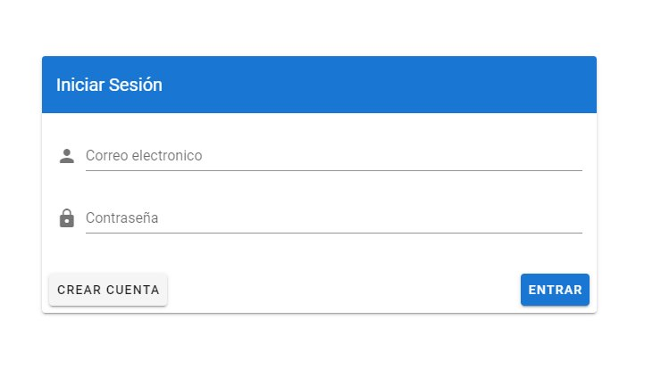

# arys-chat
Implementación de un chat en tiempo real con autenticación de doble factor para el final de la materia de Arquitectura de Redes y Servicios.

Alumnos: Emanuel Balcazar y Mauricio Savarro.

## Preparación

Instalar nodejs: [NodeJS 12.x](https://nodejs.org/es/)

Instalar VueJS:

```
npm install -g @vue/cli
```

## Despliegue

Clonar el proyecto

```
git clone https://github.com/emanuelbalcazar/arys-chat
```

Cambiar al directorio raiz del proyecto:
```
cd arys-chat
```

Instalar dependencias dentro del proyecto:
```
npm install
```

Ejecutar la aplicación con:

```
npm run serve
```

## Registrarse

1. Al entrar a http://localhost:8080 accedera a la pantalla de inicio de sesión.



Presione el boton "crear cuenta" para registrarse.

2. Complete los datos solicitados, la contraseña puede ser distinta a la utilizada en su correo electronico.


3. Se le solicitará que escanee el QR con una aplicación que sea compatible el algoritmo Time-based One-time Password (TOTP). Se sugiere utilizar Google Authenticator. Dicho codigo se guarda en su telefono y cambia cada 30 segundos por lo que se recomienda no borrarlo.


4. Si el codigo ingresado es correcto, se le redireccionará a la pantalla principal de la aplicación.


## Iniciar Sesión

Al momento de iniciar sesión, se le pedira su usuario y contraseña. Ademas se le solicitara que ingrese la clave de autenticación de doble factor que figure en su aplicación movil. En caso de haberla borrado puede volver a generarla presionando la opcion de "recuperar codigo" 


## Crear una nueva sala de chat

Si se encuentra dentro de la aplicación, puede crear una nueva sala que sera visible para todos los usuarios, al persistirse en firebase la sala estara disponible para todos y cualquiera podra unirse a su sala.


Dentro de la sala podrá chatear con los demas usuarios, tenga en cuenta que si todos los usuarios abandonan la sala esta se autoeliminará automaticamente.


En la pantalla de salas de chat, podra ver todas las salas disponibles. Puede unirse a cualquier sala sin ningun tipo de restricción.


